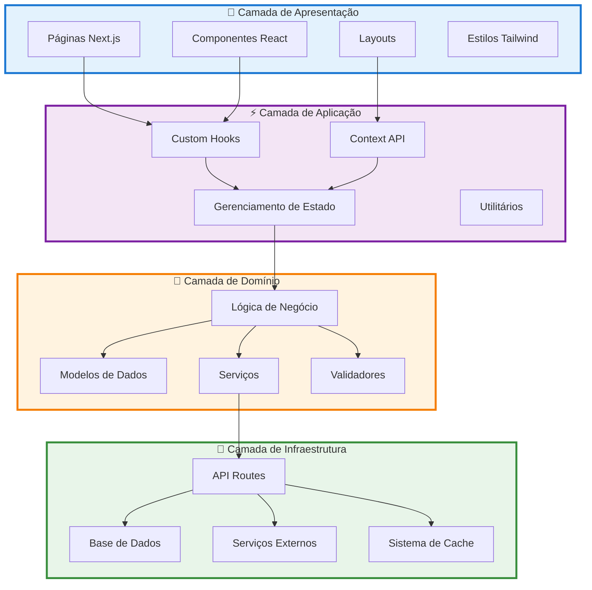
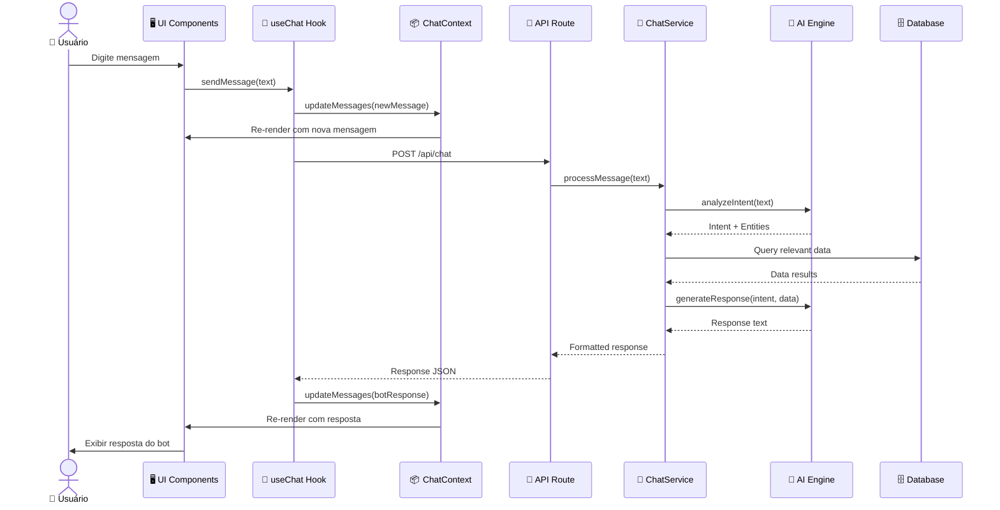
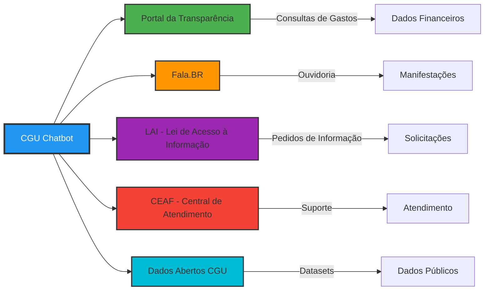
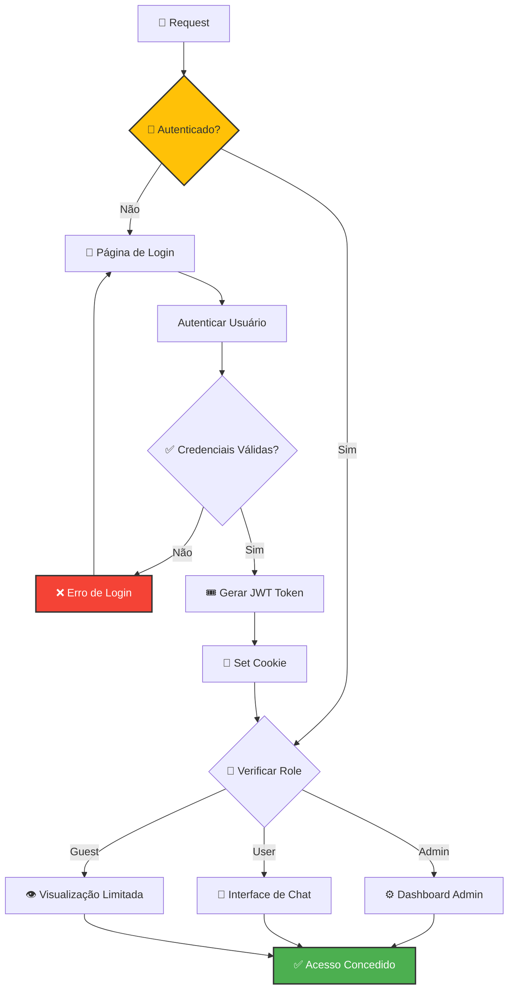
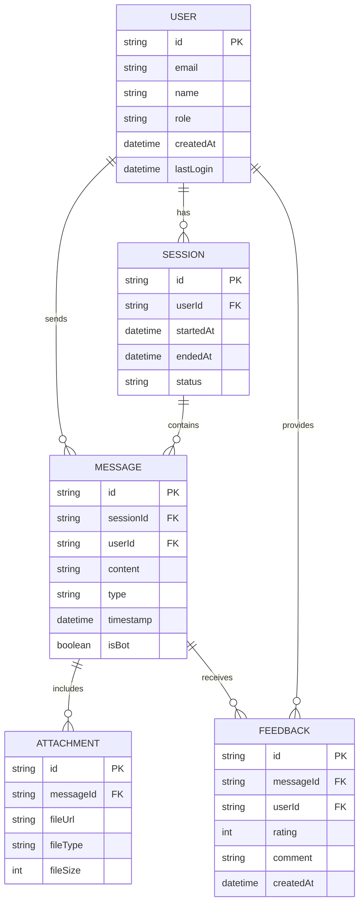
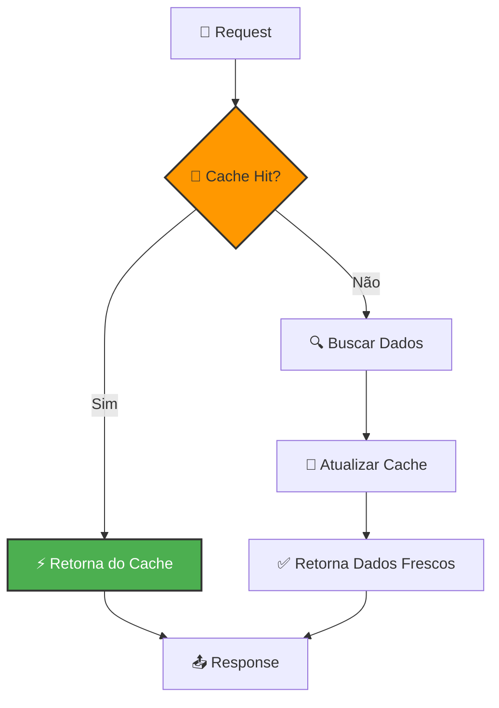
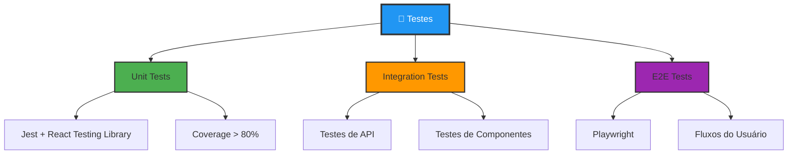
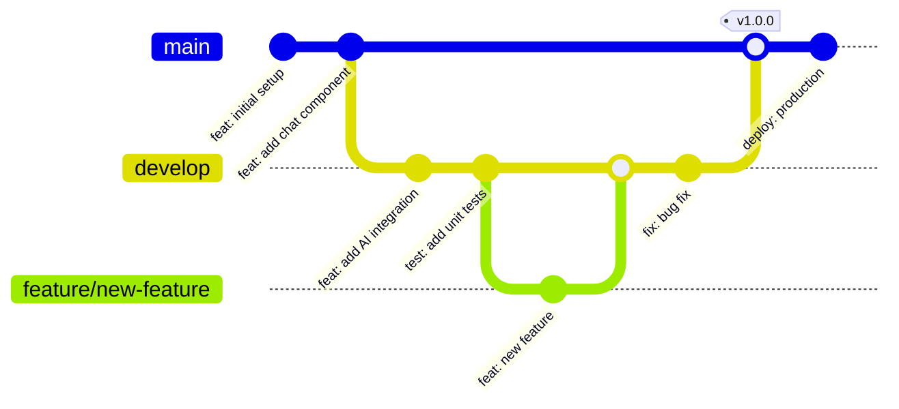
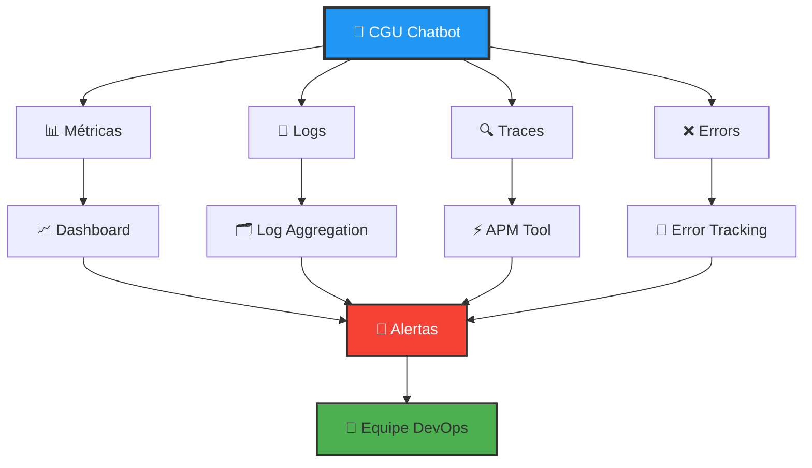
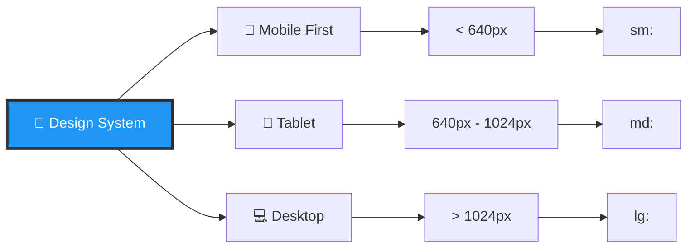

# 🏛️ Arquitetura do CGU Chatbot

## Visão Geral

Este documento descreve a arquitetura detalhada do projeto CGU Chatbot, incluindo padrões de design, estrutura de componentes e fluxo de dados.

---

## 📐 Arquitetura em Camadas



---

## 🗂️ Estrutura de Diretórios Proposta

```
cgu-chatbot/
├── 📁 app/                          # App Router do Next.js
│   ├── 📁 (auth)/                  # Grupo de rotas de autenticação
│   │   ├── 📄 login/
│   │   └── 📄 register/
│   ├── 📁 api/                     # API Routes
│   │   ├── 📁 chat/
│   │   │   └── 📄 route.ts        # POST /api/chat
│   │   ├── 📁 messages/
│   │   │   └── 📄 route.ts        # GET /api/messages
│   │   └── 📁 cgu/
│   │       └── 📄 route.ts        # Integração com APIs da CGU
│   ├── 📁 chat/                    # Página do chat
│   │   └── 📄 page.tsx
│   ├── 📁 dashboard/               # Dashboard administrativo
│   │   └── 📄 page.tsx
│   ├── 📄 globals.css             # Estilos globais
│   ├── 📄 layout.tsx              # Layout raiz
│   └── 📄 page.tsx                # Página inicial
│
├── 📁 components/                   # Componentes reutilizáveis
│   ├── 📁 chat/
│   │   ├── 📄 ChatMessage.tsx
│   │   ├── 📄 ChatInput.tsx
│   │   ├── 📄 ChatHistory.tsx
│   │   └── 📄 ChatContainer.tsx
│   ├── 📁 ui/
│   │   ├── 📄 Button.tsx
│   │   ├── 📄 Input.tsx
│   │   ├── 📄 Card.tsx
│   │   └── 📄 Loading.tsx
│   └── 📁 layout/
│       ├── 📄 Header.tsx
│       ├── 📄 Footer.tsx
│       └── 📄 Sidebar.tsx
│
├── 📁 lib/                         # Bibliotecas e utilitários
│   ├── 📁 ai/
│   │   ├── 📄 chatbot.ts          # Lógica do chatbot
│   │   └── 📄 nlp.ts              # Processamento de linguagem
│   ├── 📁 api/
│   │   ├── 📄 cgu-client.ts       # Cliente API da CGU
│   │   └── 📄 http-client.ts      # Cliente HTTP genérico
│   ├── 📁 db/
│   │   ├── 📄 client.ts           # Cliente do banco de dados
│   │   └── 📄 queries.ts          # Queries SQL/NoSQL
│   └── 📁 utils/
│       ├── 📄 validators.ts       # Validadores
│       ├── 📄 formatters.ts       # Formatadores
│       └── 📄 constants.ts        # Constantes
│
├── 📁 types/                       # Definições de tipos TypeScript
│   ├── 📄 chat.ts
│   ├── 📄 user.ts
│   └── 📄 api.ts
│
├── 📁 hooks/                       # Custom React Hooks
│   ├── 📄 useChat.ts
│   ├── 📄 useMessages.ts
│   └── 📄 useAuth.ts
│
├── 📁 context/                     # Context Providers
│   ├── 📄 ChatContext.tsx
│   ├── 📄 ThemeContext.tsx
│   └── 📄 AuthContext.tsx
│
├── 📁 public/                      # Arquivos estáticos
│   ├── 📁 images/
│   ├── 📁 icons/
│   └── 📁 fonts/
│
├── 📁 tests/                       # Testes
│   ├── 📁 unit/
│   ├── 📁 integration/
│   └── 📁 e2e/
│
├── 📁 docs/                        # Documentação adicional
│   ├── 📄 API.md
│   └── 📄 DEPLOYMENT.md
│
├── 📄 .env.local                   # Variáveis de ambiente locais
├── 📄 .env.example                 # Exemplo de variáveis
├── 📄 .gitignore
├── 📄 eslint.config.mjs
├── 📄 next.config.ts
├── 📄 package.json
├── 📄 tsconfig.json
├── 📄 README.md
├── 📄 FLOWCHART.md
└── 📄 ARCHITECTURE.md
```

---

## 🔄 Fluxo de Dados



---

## 🧩 Componentes Principais

### 1. ChatContainer

```typescript
// components/chat/ChatContainer.tsx
interface ChatContainerProps {
  initialMessages?: Message[];
  userId?: string;
  theme?: "light" | "dark";
}

export function ChatContainer({
  initialMessages,
  userId,
  theme,
}: ChatContainerProps) {
  // Gerencia o estado completo do chat
  // Coordena ChatHistory e ChatInput
  // Implementa lógica de scroll automático
}
```

### 2. ChatMessage

```typescript
// components/chat/ChatMessage.tsx
interface ChatMessageProps {
  message: Message;
  isBot: boolean;
  timestamp: Date;
  avatar?: string;
}

export function ChatMessage({
  message,
  isBot,
  timestamp,
  avatar,
}: ChatMessageProps) {
  // Renderiza mensagem individual
  // Suporta markdown
  // Mostra indicador de digitação
}
```

### 3. useChat Hook

```typescript
// hooks/useChat.ts
interface UseChatReturn {
  messages: Message[];
  sendMessage: (text: string) => Promise<void>;
  isLoading: boolean;
  error: Error | null;
  clearHistory: () => void;
}

export function useChat(config?: ChatConfig): UseChatReturn {
  // Gerencia estado das mensagens
  // Envia requisições para API
  // Trata erros e loading
}
```

---

## 🔌 Integrações com APIs da CGU



---

## 🔐 Segurança e Autenticação



---

## 📊 Modelo de Dados



---

## ⚡ Estratégias de Performance

### 1. Server Components

```typescript
// app/chat/page.tsx - Server Component por padrão
export default async function ChatPage() {
  // Busca dados no servidor
  const initialData = await fetchInitialMessages();

  return (
    <ChatContainer initialMessages={initialData}>
      <ChatHistory /> {/* Client Component */}
    </ChatContainer>
  );
}
```

### 2. Streaming e Suspense

```typescript
import { Suspense } from "react";

export default function Page() {
  return (
    <Suspense fallback={<ChatSkeleton />}>
      <ChatContainer />
    </Suspense>
  );
}
```

### 3. Caching



---

## 🧪 Estratégia de Testes



---

## 🚀 Pipeline de Deploy



### Stages do Pipeline

1. **Commit** → Lint e Format Check
2. **Push** → Unit Tests
3. **PR** → Integration Tests + Code Review
4. **Merge to Develop** → Deploy to Staging
5. **Merge to Main** → Deploy to Production

---

## 📈 Monitoramento e Observabilidade



---

## 🌍 Internacionalização (i18n)

```typescript
// Estrutura de tradução
const translations = {
  "pt-BR": {
    chat: {
      placeholder: "Digite sua mensagem...",
      send: "Enviar",
      welcome: "Bem-vindo ao CGU Chatbot!",
    },
  },
  en: {
    chat: {
      placeholder: "Type your message...",
      send: "Send",
      welcome: "Welcome to CGU Chatbot!",
    },
  },
};
```

---

## 📱 Responsividade



---

<div align="center">

**Documentação de Arquitetura - CGU Chatbot**

[← Voltar para README](./README.md) | [Ver Fluxogramas](./FLOWCHART.md)

</div>
