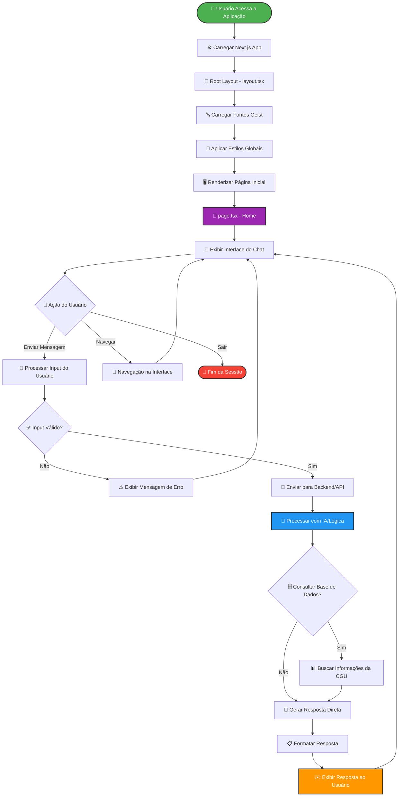
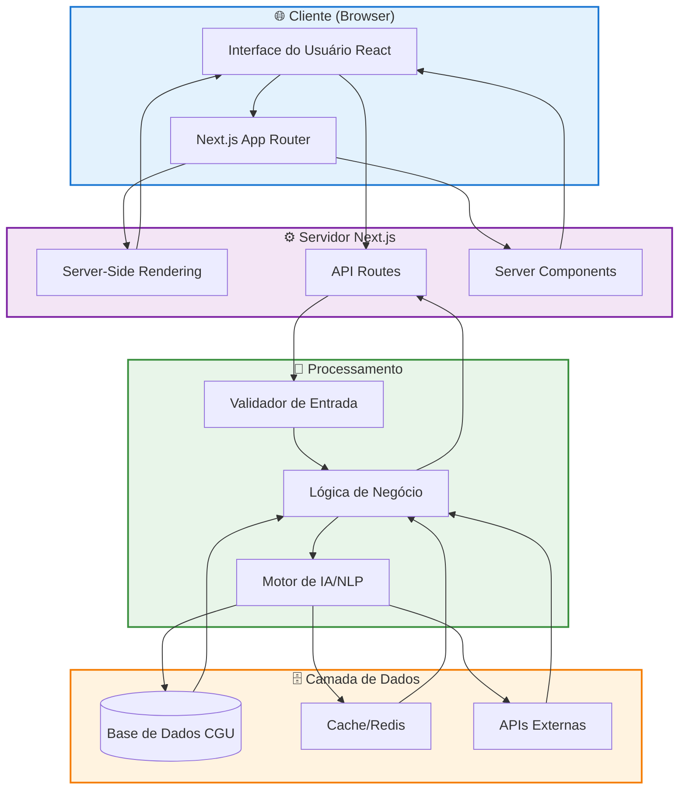
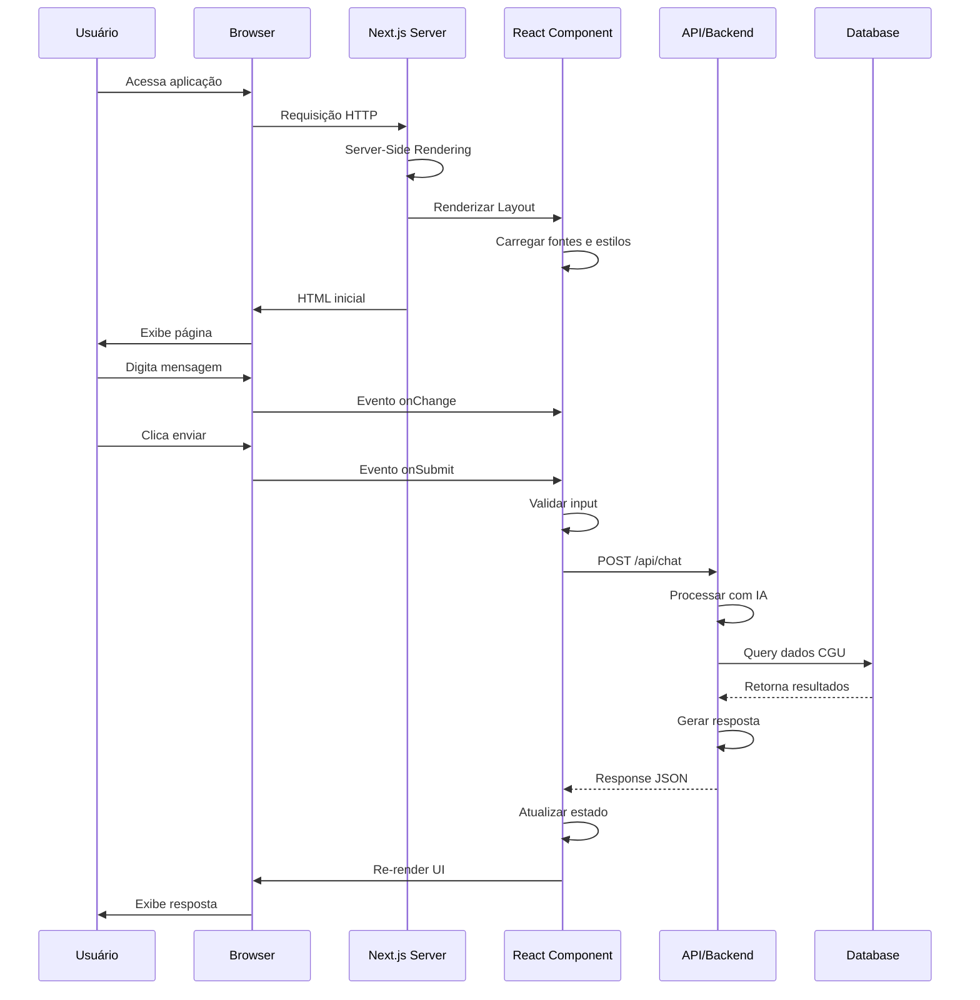
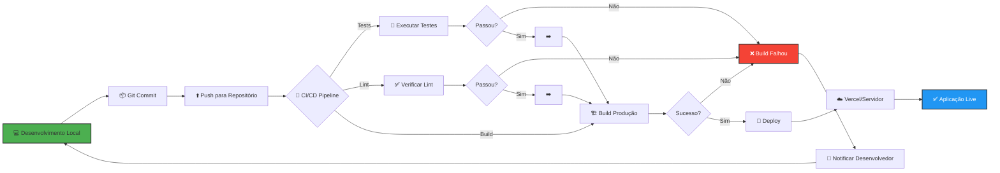
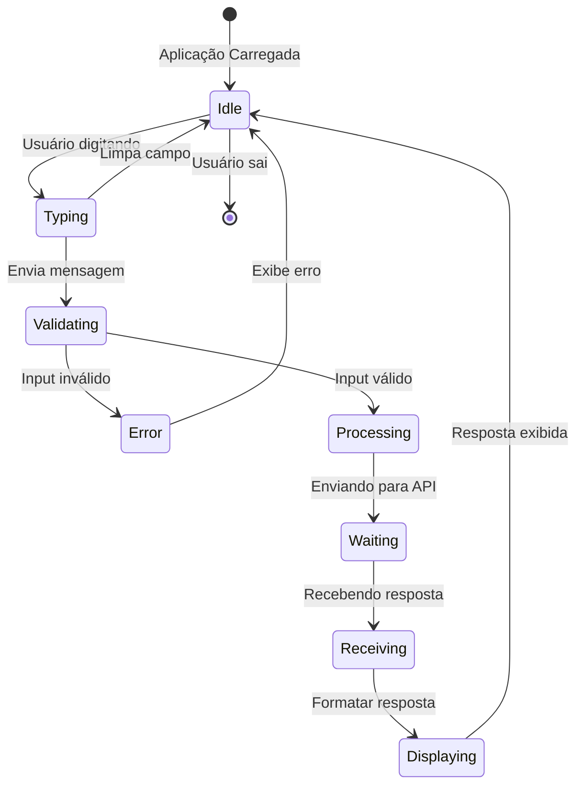

# 📊 Fluxograma da Aplicação CGU Chatbot

## Fluxograma Principal

---

## Fluxograma de Arquitetura Técnica

---

## Fluxograma do Ciclo de Vida do Componente

---

## Fluxograma de Deploy e Build

---

## Fluxograma de Estados do Chat

---

## Descrição dos Fluxos

### 1. Fluxograma Principal

Representa o fluxo completo de interação do usuário com a aplicação, desde o acesso inicial até o recebimento de respostas do chatbot.

**Pontos-chave:**

- Inicialização da aplicação Next.js
- Carregamento de recursos (fontes, estilos)
- Interação do usuário
- Processamento de mensagens
- Exibição de respostas

### 2. Arquitetura Técnica

Mostra a separação em camadas da aplicação e como elas se comunicam.

**Camadas:**

- **Cliente**: Interface React e roteamento
- **Servidor**: SSR e API routes
- **Dados**: Banco de dados e cache
- **Processamento**: IA e lógica de negócio

### 3. Ciclo de Vida do Componente

Demonstra a sequência de eventos e comunicação entre os diferentes componentes do sistema.

**Fluxo:**

1. Requisição inicial do usuário
2. Server-Side Rendering
3. Interação com o chat
4. Comunicação com API
5. Atualização da interface

### 4. Deploy e Build

Ilustra o processo de continuous integration e deployment.

**Etapas:**

1. Desenvolvimento local
2. Commit e push
3. Pipeline CI/CD
4. Testes automatizados
5. Build de produção
6. Deploy

### 5. Estados do Chat

Diagrama de estados mostrando as diferentes fases da interação no chat.

**Estados:**

- Idle (ocioso)
- Typing (digitando)
- Validating (validando)
- Processing (processando)
- Waiting (aguardando)
- Displaying (exibindo)

---

## Como Visualizar

### Ferramentas Recomendadas

1. **GitHub / GitLab**

   - Renderizam Mermaid automaticamente em arquivos `.md`

2. **VS Code**

   - Extensão: [Markdown Preview Mermaid Support](https://marketplace.visualstudio.com/items?itemName=bierner.markdown-mermaid)

3. **Mermaid Live Editor**

   - Acesse: [mermaid.live](https://mermaid.live/)
   - Cole o código Mermaid para editar e exportar

4. **Confluence / Notion**
   - Suportam Mermaid diagrams nativamente

---

## Legenda de Símbolos

| Símbolo | Significado             |
| ------- | ----------------------- |
| 👤      | Usuário                 |
| ⚙️      | Processamento/Sistema   |
| 🤖      | Inteligência Artificial |
| 🗄️      | Banco de Dados          |
| 🚀      | Deploy/API              |
| ✅      | Validação/Sucesso       |
| ❌      | Erro/Falha              |
| 💬      | Interface/Chat          |
| 📊      | Dados/Informação        |

---

**Documentação do Fluxograma - CGU Chatbot**

[← Voltar para README](./README.md)

