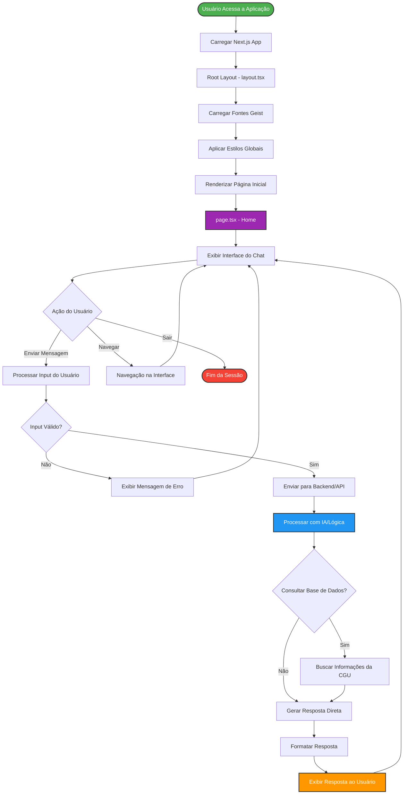

# 🤖 CGU Chatbot

<div align="center">


**Chatbot inteligente para a Controladoria-Geral da União (CGU)**

[Sobre](#-sobre) • [Funcionalidades](#-funcionalidades) • [Instalação](#-instalação) • [Uso](#-uso) • [Fluxograma](#-fluxograma) • [Tecnologias](#-tecnologias) • [Contribuição](#-contribuição)

</div>

---

## 📋 Sobre

O **CGU Chatbot** é uma aplicação web moderna desenvolvida para auxiliar cidadãos e servidores públicos a obterem informações sobre os serviços, processos e dados da Controladoria-Geral da União. Construído com Next.js 15 e React 19, oferece uma interface responsiva e intuitiva para interação via chat.

### 🎯 Objetivos

- Facilitar o acesso à informação pública
- Automatizar respostas a perguntas frequentes
- Melhorar a experiência do usuário com a CGU
- Reduzir o tempo de resposta em consultas comuns
- Promover transparência e acessibilidade

---

## ✨ Funcionalidades

- 💬 **Interface de Chat Intuitiva**: Comunicação natural com o chatbot
- 🎨 **Design Responsivo**: Adaptável a dispositivos móveis, tablets e desktops
- 🌙 **Modo Escuro**: Suporte automático para tema claro e escuro
- ⚡ **Performance Otimizada**: Utilizando Next.js 15 com Turbopack
- 🔍 **Busca Inteligente**: Respostas contextualizadas sobre serviços da CGU
- ♿ **Acessibilidade**: Desenvolvido seguindo as melhores práticas de acessibilidade

---

## 🚀 Instalação

### Pré-requisitos

- Node.js 20.x ou superior
- npm, yarn, pnpm ou bun
- Git

### Passos para Instalação

1. **Clone o repositório**

   ```bash
   git clone https://github.com/devLucasEmiliano/cgu-chatbot.git
   cd cgu-chatbot
   ```

2. **Instale as dependências**

   ```bash
   npm install
   # ou
   yarn install
   # ou
   pnpm install
   ```

3. **Configure as variáveis de ambiente** (se necessário)

   ```bash
   cp .env.example .env.local
   ```

4. **Execute o servidor de desenvolvimento**

   ```bash
   npm run dev
   ```

5. **Abra o navegador**
   - Acesse [http://localhost:3000](http://localhost:3000)

---

## 💻 Uso

### Comandos Disponíveis

```bash
# Desenvolvimento com Turbopack
npm run dev

# Build para produção
npm run build

# Iniciar servidor de produção
npm run start

# Executar lint
npm run lint
```

### Estrutura do Projeto

```
cgu-chatbot/
├── app/                    # Diretório principal do App Router
│   ├── globals.css        # Estilos globais
│   ├── layout.tsx         # Layout raiz da aplicação
│   └── page.tsx           # Página inicial
├── public/                # Arquivos estáticos
├── eslint.config.mjs      # Configuração do ESLint
├── next.config.ts         # Configuração do Next.js
├── next-env.d.ts          # Tipos TypeScript do Next.js
├── package.json           # Dependências e scripts
├── postcss.config.mjs     # Configuração do PostCSS
├── tsconfig.json          # Configuração do TypeScript
└── README.md              # Este arquivo
```

---

## 📊 Fluxograma da Aplicação



### Descrição do Fluxo

1. **Inicialização**

   - Usuário acessa a aplicação
   - Next.js carrega o app com SSR/SSG
   - Root Layout define a estrutura base

2. **Carregamento de Recursos**

   - Fontes Geist (Sans e Mono) são otimizadas
   - Estilos globais com Tailwind são aplicados
   - Componentes React são hidratados

3. **Interface do Usuário**

   - Página inicial renderizada
   - Interface do chat exibida
   - Elementos responsivos e acessíveis

<<<<<<< HEAD
Check out our [Next.js deployment documentation](https://nextjs.org/docs/app/building-your-application/deploying) for more details.

## API de Manifestações (COP30)

Endpoint interno:
- POST `/api/manifestacoes` (Next.js Route Handler)

Payload de entrada (DTO):
- `idTipoFormulario`, `idTipoManifestacao`, `idOuvidoriaDestino`, `idModoResposta`, `idTipoIdentificacaoManifestante`
- `manifestante?` com `{ idPais, nome, email }`
- `paisNaturalidade?`, `linguagem?`, `numeroUnfccc?`, `textoUsuario`
- `anexos?`: lista de `{ NomeArquivo, ConteudoBase64, TamanhoArquivo }`

Regras implementadas:
- Texto com cabeçalho COP30 e limite de 8000 caracteres (com truncamento)
- Validação de combinação `IdTipoManifestacao` × `IdTipoFormulario` conforme matriz fornecida
- Anexos: até 10 itens, cada um até 30MB; gzip + Base64

Configuração por ambiente:
- `CGU_API_BASE_URL` (default: `https://treinafalabr.cgu.gov.br`)
- `CGU_API_TOKEN` (opcional)
- `CGU_ID_OUVIDORIA_DESTINO` (server-only): usado quando o front não enviar `idOuvidoriaDestino`
- `CGU_ID_MODO_RESPOSTA` (server-only): usado quando o front não enviar `idModoResposta`

Exemplo:
Crie um arquivo `.env.local` baseado em `.env.local.example`:

```
CGU_ID_OUVIDORIA_DESTINO=123
CGU_ID_MODO_RESPOSTA=1
# CGU_API_BASE_URL=https://treinafalabr.cgu.gov.br
# CGU_API_TOKEN=seu_token
```

Encaminhamento para CGU:
- POST `https://treinafalabr.cgu.gov.br/api/manifestacoes`
=======
4. **Interação**

   - Usuário envia mensagem
   - Input é validado
   - Processamento via API/Backend

5. **Processamento**

   - Lógica de IA/chatbot processa a consulta
   - Base de dados da CGU é consultada (se necessário)
   - Resposta é gerada e formatada

6. **Resposta**
   - Mensagem é exibida na interface
   - Usuário pode continuar a conversa
   - Ciclo se repete

---

## 🛠️ Tecnologias

### Core

- **[Next.js 15.2.4](https://nextjs.org/)** - Framework React com SSR e SSG
- **[React 19.0.0](https://react.dev/)** - Biblioteca para interfaces de usuário
- **[TypeScript 5](https://www.typescriptlang.org/)** - Superset JavaScript tipado

### Estilização

- **[Tailwind CSS 4](https://tailwindcss.com/)** - Framework CSS utility-first
- **[PostCSS](https://postcss.org/)** - Transformador CSS
- **[Geist Font](https://vercel.com/font)** - Família de fontes otimizada

### Ferramentas de Desenvolvimento

- **[ESLint 9](https://eslint.org/)** - Linter para código JavaScript/TypeScript
- **[Turbopack](https://turbo.build/pack)** - Bundler de alta performance

---

## 🏗️ Arquitetura

### App Router (Next.js 15)

O projeto utiliza o **App Router** do Next.js, que oferece:

- ✅ Layouts aninhados
- ✅ Server Components por padrão
- ✅ Streaming e Suspense
- ✅ Roteamento baseado em arquivos
- ✅ Otimizações automáticas

### Renderização

- **Server-Side Rendering (SSR)**: Páginas dinâmicas renderizadas no servidor
- **Static Site Generation (SSG)**: Páginas estáticas pré-renderizadas
- **Client Components**: Interatividade no lado do cliente

---

## 🤝 Contribuição

Contribuições são bem-vindas! Siga os passos abaixo:

1. Fork o projeto
2. Crie uma branch para sua feature (`git checkout -b feature/AmazingFeature`)
3. Commit suas mudanças (`git commit -m 'Add some AmazingFeature'`)
4. Push para a branch (`git push origin feature/AmazingFeature`)
5. Abra um Pull Request

### Padrões de Código

- Use TypeScript para todos os arquivos
- Siga as convenções do ESLint configurado
- Escreva commits descritivos
- Documente novas funcionalidades

---

## 📝 Licença

Este projeto está sob a licença MIT. Veja o arquivo `LICENSE` para mais detalhes.

---

## 👥 Autores

- **Lucas Emiliano** - _Desenvolvedor Principal_ - [@devLucasEmiliano](https://github.com/devLucasEmiliano)

---

## 📞 Contato

Para dúvidas, sugestões ou contribuições:

- 📧 Email: [seu-email@exemplo.com]
- 🐙 GitHub: [https://github.com/devLucasEmiliano/cgu-chatbot](https://github.com/devLucasEmiliano/cgu-chatbot)
- 🌐 Website: [CGU - Controladoria-Geral da União](https://www.gov.br/cgu)

---

## 🙏 Agradecimentos

- Controladoria-Geral da União (CGU)
- Comunidade Next.js
- Comunidade React
- Vercel pela infraestrutura e ferramentas

---

<div align="center">

**Desenvolvido com ❤️ para promover transparência e acessibilidade**

[⬆ Voltar ao topo](#-cgu-chatbot)

</div>
>>>>>>> 34e440b (	modified:   README.md)
